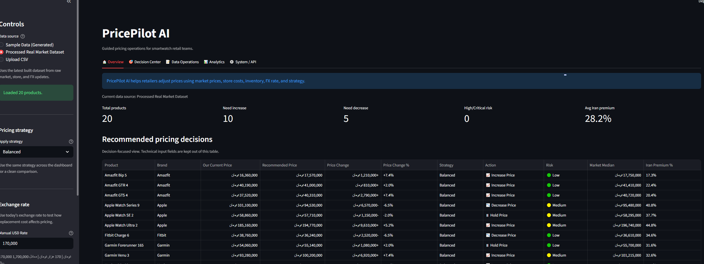
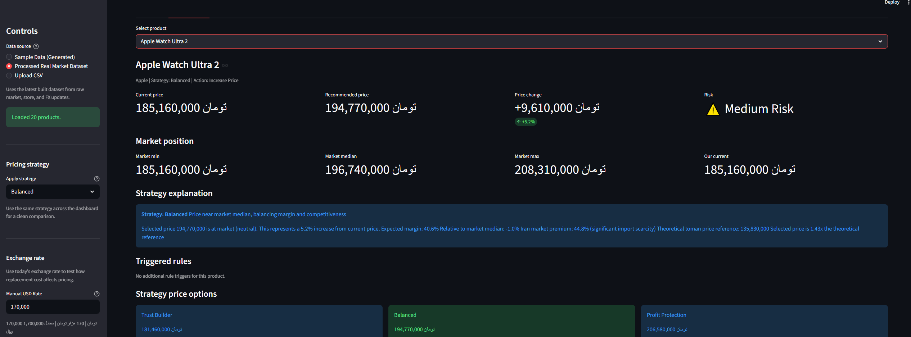
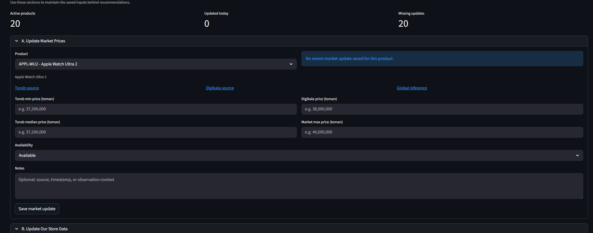
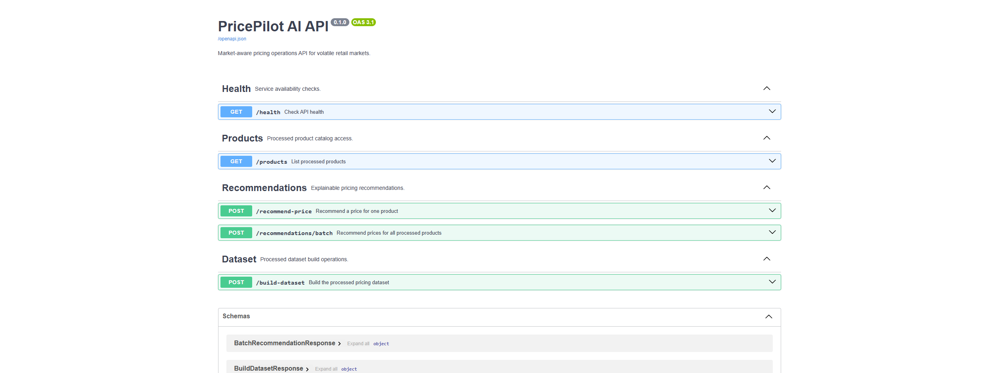
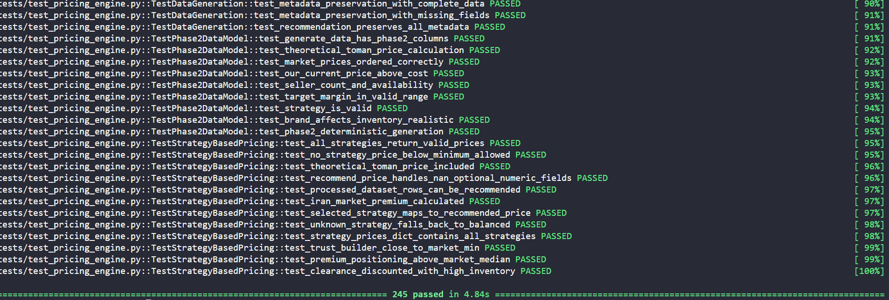

# PricePilot AI

PricePilot AI is a market-aware pricing operations system for volatile retail markets. It helps retailers combine market observations, store costs, inventory, FX rates, and pricing strategy to generate explainable price recommendations.

The project is intentionally human-in-the-loop: it supports pricing decisions, but does not automatically change store prices.

## Live Demo

Streamlit demo:  
https://pricepilot-ai.streamlit.app/

The public demo uses a packaged 20-product Iranian smartwatch/wearable scenario. It is realistic demo data, not live-scraped market data.

## Screenshots

### Overview


### Decision Center


### Data Operations


### FastAPI Backend


### Test Suite


## Features

- Guided Streamlit dashboard for pricing operations
- 20-product Iranian smartwatch/wearable demo scenario
- Manual USD/Toman FX rate control, defaulting to 170,000 toman
- Decision-focused recommendations table and product-level analysis
- Six deterministic pricing strategies
- Market, store, FX, add-product, and dataset rebuild workflows
- Raw-to-processed CSV pipeline for reproducible recommendations
- FastAPI backend for local integration demos
- Docker configuration for optional containerized runs
- Automated test coverage for data, formatting, API, and pricing behavior

## Architecture

```text
data/raw/
  products_master.csv
  market_observations_template.csv
  daily_market_updates.csv
  retailer_internal_demo_template.csv
  global_usd_reference_template.csv
  fx_rate_snapshots.csv
          |
          v
src/data/build_pricing_dataset.py
          |
          v
data/processed/dashboard_pricing_data.csv
          |
          v
src/pricing/                 src/dashboard/app.py
recommendation engine        Streamlit UI
          |
          v
src/api/main.py
FastAPI backend
```

## Demo Scenario Data

The packaged demo scenario lives in:

```text
data/scenarios/iran_smartwatch_demo_20/
```

It includes 20 realistic smartwatch and wearable products, fictional market observations, store cost/inventory data, and a demo FX snapshot. It is designed for portfolio presentation and workflow testing, not as live market intelligence.

Load the scenario locally:

```bash
python scripts/load_demo_scenario.py
```

## Local Streamlit Dashboard

Install dependencies and run the dashboard:

```bash
python -m pip install -r requirements.txt
python scripts/load_demo_scenario.py
streamlit run src/dashboard/app.py
```

Open `http://localhost:8501`. The dashboard will also prepare the packaged demo dataset automatically if the processed CSV is missing.

## Local FastAPI Backend

The FastAPI backend is included in the repository and can be run locally. The public demo focuses on the Streamlit dashboard.

Run the API:

```bash
python -m uvicorn src.api.main:app --reload
```

Interactive API docs are available at:

```text
http://127.0.0.1:8000/docs
```

Main endpoints:

- `GET /health`
- `GET /products`
- `POST /recommend-price`
- `POST /recommendations/batch`
- `POST /build-dataset`

## Docker

Docker configuration is included but optional.

```bash
docker compose up --build
```

This runs the API and Streamlit dashboard together using the shared project `data/` directory.

## Testing

Run the full test suite:

```bash
python -m pytest tests/ -v --tb=short
```

The tests cover pricing logic, data validation, manual entry helpers, dataset builds, scenario loading, formatting, and API behavior.

## Portfolio Links

- [Case Study](docs/CASE_STUDY.md)
- [Screenshot Guide](docs/SCREENSHOT_GUIDE.md)
- [Phase 2 Design](docs/PHASE_2_DESIGN.md)
- [Real Data Plan](docs/PHASE_3_REAL_DATA_PLAN.md)

## Scope

PricePilot AI is a portfolio MVP and decision-support tool, not an autonomous repricing system. It does not scrape retailer sites, call external market APIs, or claim live Iranian market coverage. A human seller remains responsible for any commercial price change.
