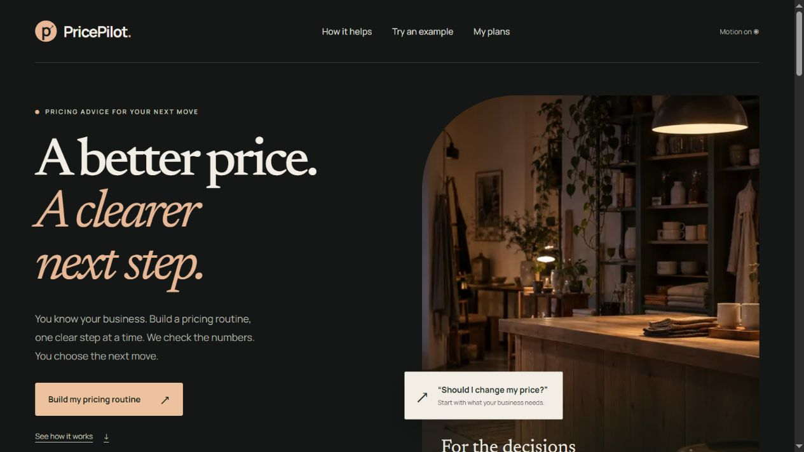
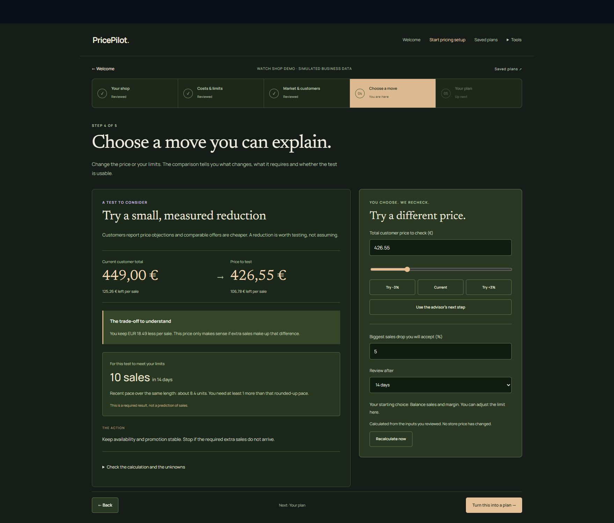
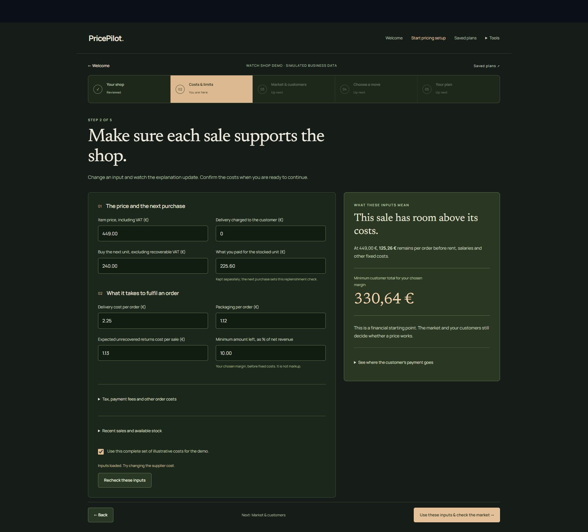
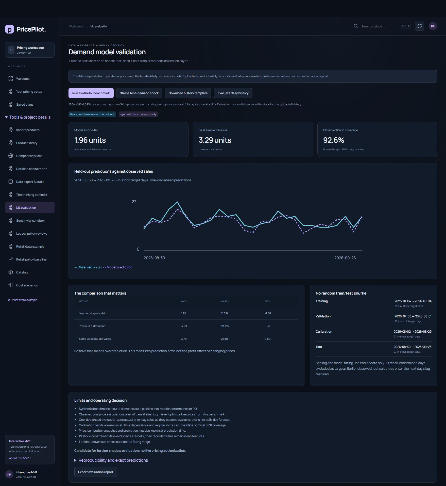

# PricePilot

### A better price. A clearer next step.

**Turn product costs, market evidence and customer observations into a pricing decision you can explain—and a plan you can review.**

PricePilot is an interactive **Data + AI + Business** MVP for independent retailers, demonstrated through a German online watch shop. It helps an owner decide whether to test a price, fix the offer or gather better evidence, while making the trade-off between sales and contribution visible.

**[Open the live demo →](https://sepas.eu.pythonanywhere.com/)** · [Explore the method](docs/ECONOMIC_FOUNDATIONS.md) · [Read the model card](docs/MODEL_CARD.md)

[](https://github.com/SZohari/pricepilot-ai/actions/workflows/tests.yml)


[](https://sepas.eu.pythonanywhere.com/)

*No installation or account needed. The shop is fictional; all bundled costs, prices, sales and competitor offers are simulated. Each visitor gets a separate temporary workspace.*

## The business question

**“A competitor is cheaper. Should I lower my price?”**

A useful answer needs more than a price comparison. A discount reduces the amount left from each order. Extra sales only help if they make up that reduction—and the shop has enough stock to fulfil them. Sometimes the real problem is visibility, delivery or an offer that customers do not understand.

PricePilot connects these questions in one guided routine:

| Step | What the owner does | What becomes clear |
| --- | --- | --- |
| **01 · Your shop** | Choose a product and an acceptable sales-loss limit | The offer and the objective |
| **02 · Costs & limits** | Review purchase/replacement costs, VAT, fees and fulfilment | What each sale leaves before fixed costs |
| **03 · Market & customers** | Check comparable offers and add customer observations | Which evidence supports a change—and what is missing |
| **04 · Choose a move** | Adjust a candidate price and inspect the consequences | Required sales, margin limits and capacity |
| **05 · Your plan** | Save the action, record implementation and review results | What happened and whether the agreed limits were met |

## See a decision take shape

In the default watch example, a **€449.00** customer price leaves **€125.26** per sale before fixed costs. A 5% reduction to **€426.55** leaves **€106.78**. To preserve contribution and the chosen sales limit, the trial needs **at least 10 sales in 14 days**, compared with a recent pace of 8.4 over that period.

Those 10 sales are a **required result**, not a demand forecast. If available stock cannot support the requirement, the system blocks the trial.



**Try it yourself:** open the demo, choose **Build my pricing routine**, change the replacement cost, then compare a price reduction with an increase. Go back to customer context and select low visibility before using **Use the advisor’s next step**: the advice can change to investigating traffic before discounting.

<details>
<summary><strong>See the cost inputs behind the recommendation</strong></summary>



Cost edits recalculate a preview before confirmation. Changing an earlier input invalidates dependent steps, so a plan cannot silently rely on an outdated calculation.

</details>

## Built around business trade-offs

- **Protect contribution and sales together.** Price trials must clear the chosen margin, volume and capacity limits. Contribution is the amount left after variable costs; it is not net profit.
- **Compare the complete offer.** Delivered price, availability, evidence age and comparability matter. Stale or unavailable offers cannot silently drive a reduction.
- **Give local knowledge a place.** Record an observation, hypothesis or open question about trust, delivery or customer needs. A question marked as essential pauses the price trial until reviewed.
- **Make the next action usable.** Import CSV/TSV with mapping and preview, save a decision with its input snapshot, export a review sheet, and follow up using actual sales and costs.
- **Automate supported evidence collection.** A configurable JSON-LD collector checks exact product URLs and streams results. Unsupported sources remain visible. No live retailer is preconfigured, and public visitors cannot add fetch URLs. [Collection setup →](docs/LIVE_COLLECTION.md)

The design draws on selected ideas about local knowledge, subjective value and discovery: the owner's knowledge can change the decision, and a price remains a hypothesis to investigate. The [economic foundations](docs/ECONOMIC_FOUNDATIONS.md) connect those ideas to implemented behaviour and explain their limits.

## Where machine learning fits

The **Demand model lab** trains a ridge regression model to estimate next-day unit sales using price, competitor price, promotion, calendar patterns and recent sales. Training, model selection, error-band calibration and testing follow time order. Two simple baselines make the result interpretable.

| Synthetic example · seed 73 | Model MAE ↓ | Best baseline MAE ↓ | Result |
| --- | ---: | ---: | --- |
| Stable conditions | 1.96 units | 3.29 units | Beats both baselines |
| Unseen demand shock | 5.88 units | 2.99 units | Fails baseline comparison |

Both cases are available in the live demo. The [five-seed report](docs/demand-evaluation.json) shows the same pass/fail pattern across all five seeds. These are synthetic evaluation results, not evidence of merchant ROI.

<details>
<summary><strong>See the live model evaluation</strong></summary>



</details>

The pricing consultant uses inspectable rules and Decimal accounting. The learned model is a separate research component: observational price associations do not establish causal elasticity, and it cannot publish a price. [Model design, validation and limitations →](docs/MODEL_CARD.md)

## Under the hood

**Python · FastAPI · Pydantic · NumPy · SQLite · native JavaScript modules**

```text
Browser workflow → Versioned API → Application services → Domain contracts
                                      │                       │
                                SQLite + audit         Decimal economics
                                                       Demand evaluation
```

The UI and API share the same decision service. Version checks reject stale writes; saved plans retain their evidence and input fingerprint. The public demo isolates visitors' workspaces. No external AI API key or frontend build is required.

[Architecture](docs/ARCHITECTURE.md) · [Advisor implementation](src/application/advisor.py) · [Demand model](src/domain/demand.py) · [Decision tests](tests/v1/test_advisor.py)

## Run locally

Use **Python 3.12 or 3.13**:

```bash
git clone https://github.com/SZohari/pricepilot-ai.git
cd pricepilot-ai
python -m venv .venv
# Activate: .venv\Scripts\activate on Windows; source .venv/bin/activate on macOS/Linux
python -m pip install -r requirements-web.txt
python run.py
```

Open **http://127.0.0.1:8000**. On Windows, you can also double-click **`Start PricePilot.cmd`** after installing dependencies. Keep the terminal open; press Ctrl+C to stop. Use `python run.py --port 8001` if needed. API docs: **http://127.0.0.1:8000/docs**.

[راهنمای اجرای فارسی](RUN_ME_FA.md) · [Hosting and demo status](docs/ONLINE_DEMO.md)

<details>
<summary><strong>Run the checks and reproduce the evaluations</strong></summary>

```bash
python -m pip install -r requirements-dev.txt
python -m pytest
node --test tests/web/*.test.mjs
python -m scripts.evaluate --output docs/evaluation-baseline.json
python -m scripts.evaluate_demand --output docs/demand-evaluation.json
```

CI runs Python 3.12/3.13 and the browser-logic tests. The legacy Streamlit smoke test may skip without compatible PyArrow; the primary FastAPI interface has its own integration tests.

</details>

## Scope and next milestone

**Ready to explore as a portfolio MVP.** The consultation, import, review/export and ML evaluation workflows are implemented. Public demo work resets after server restart or two hours of inactivity; export datasets and plans separately to keep them. Hosting uses a free experimental ASGI service with availability limits.

Commercial validation is still ahead: a scoped merchant pilot, reliable store/source integrations and measured decision outcomes. Cross-product substitution, customer retention, strategic competitor reactions and multi-period cash/inventory optimisation are not modelled. Store price changes remain a human action.

The next milestone is one retailer, a small catalog and a reviewable pilot: measure time saved, evidence coverage and observed contribution/volume outcomes before expanding automation.

[Business case & pilot](docs/PRODUCT_STRATEGY.md) · [Technical and business review](docs/READINESS_REVIEW.md) · [Roadmap](ROADMAP.md) · [Product & accounting details](docs/RETAIL_DECISION_SYSTEM.md)
